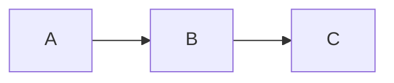

# MDXit

用语义组件提升 Markdown 的信息密度，不变成 HTML。普通 Markdown 能表达的内容不要改写成组件。

## 安装

分两步：安装 skill（agent 知道怎么写 MDXit），安装运行时（预览渲染文档）。

### 1. 安装 Skill

```bash
npx skills add charlzyx/mdxit
```

`npx skills list` 确认 `mdxit` 出现在列表中。

### 2. 安装运行时（MDXit 项目本身）

```bash
git clone https://github.com/charlzyx/mdxit.git && cd mdxit
npm install && npm run build
```

预览文档：

```bash
node dist/cli/index.js preview examples          # 预览 examples 目录
node dist/cli/index.js preview docs/             # 预览指定目录
node dist/cli/index.js preview docs/proposal.md  # 预览单文件
node dist/cli/index.js init docs/my-review.md    # 创建新文档
```

常用：`npm run dev` 启动 Vite dev server，HMR 实时刷新。

## /mdxit 命令

用户输入 `/mdxit <path>` 时，将 `<path>` 作为要预览的 MD/MDX 文件或文件夹：

```bash
MDXIT_FILE=<path> npm run dev
```

路径可以是文件或目录。默认预览该路径下的所有 `.md` / `.mdx` 文件，自动生成导航树。

## 先判断

使用 MDXit：

- 用户要 PRD、架构方案、QA 报告、迁移计划、决策记录、审查报告。
- 文档需要对比、指标、折叠、进度、步骤、图表等空间组织。
- 用户需要交互预览，让审查者回答问题或提交修改意见。

不要使用 MDXit：

- 随口问答、短说明、纯聊天回复。
- 用户明确要求纯 Markdown 或纯文本。
- 长期归档且不需要预览时，不要加 `AskQuestion`。

不确定是否启用交互时，先问：这个文档需要用户在预览页里回答问题或提交修改意见吗？

## 对存量 Markdown 的工作模式

用户给到已有 `.md` 文件需要增强时，有三种模式：

1. **原地修改**：直接修改当前 `.md` 文件，将内容调整为 MDXit 增强语法。适合用户明确表示"改这个文件"的场景。
2. **复制增强**：复制原文件为 `<原名>.review.md`，在新文件中调整语法，原文件不动。适合用户想保留原始版本、或需要对比的场景。
3. **询问选择**：用户未明确时，先列出两种模式让用户选。**默认推荐复制方式**。

无论哪种模式，只做以下增强：
- 多段对比 → `:::grid` / `<Grid>`
- 指标数字 → `<Insight metric>`
- 进度/阶段 → `<ProgressBar>` / `<Steps>`
- 选项切换 → `<Tabs>`
- 详细展开 → `<Fold>`
- 文件清单 → `<Tree>`
- 需要确认的结论 → `<AskQuestion>`
- 风险/警告文本 → `[!NOTE/TIP/OK/WARNING/DANGER]`

不改动原文的事实性内容，不添加原文没有的信息。

## 写作原则

1. 正文、列表、表格、引用、代码块、task list 都用标准 Markdown。
2. 简单检查项用 `- [ ] item` / `- [x] item`。
3. 组件只用于提升空间组织效率，不用于排版装饰。
4. `<b>` 放标题，children 放正文，`<small>` 放补充信息。
5. 用户用中文时，文档内容用中文。

## 增强语法

提示块：

```md
> [!NOTE]
> 普通说明

> [!TIP]
> 建议

> [!OK]
> 已确认/通过

> [!WARNING]
> 警告

> [!DANGER]
> 严重风险
```

Mermaid：

````md

````

Diff：

````md
```diff
- old code
+ new code
```
````

## 内置组件

### Insight / Insights

决策、风险、摘要、指标卡。`metric` 属性切换为大字数值模式。

```mdx
<Insights columns={3}>
  <Insight ok><b>认证</b>JWT 方案</Insight>
  <Insight risk><b>迁移</b>1.2 亿条记录</Insight>
  <Insight metric warn><b>错误率</b><small>超时为主</small>0.12%</Insight>
</Insights>
```

### Grid / GridItem

多栏对比布局。优先用 directive 写法：

```md
:::grid 2
:::item ok badge="推荐"
<b>模块化单体</b>
部署简单，适合当前团队规模。
:::
:::item warn badge="备选"
<b>微服务拆分</b>
治理能力更强，复杂度更高。
:::
:::
```

directive 写法不支持时，降级为 JSX：

```mdx
<Grid columns={2}>
  <GridItem ok badge="推荐"><b>模块化单体</b></GridItem>
  <GridItem warn badge="备选"><b>微服务拆分</b></GridItem>
</Grid>
```

### ProgressBar

```mdx
<ProgressBar value={72} ok>
  <b>整体完成度</b>
  18 / 25 个任务已完成
</ProgressBar>
```

### Steps / Step

垂直时间线或水平步骤条。

```mdx
<Steps horizontal active={2}>
  <Step><b>需求</b>已完成</Step>
  <Step><b>开发</b>进行中</Step>
  <Step><b>测试</b>待开始</Step>
</Steps>
```

### Tabs / Tab

同一材料的多视图切换。

```mdx
<Tabs>
  <Tab label="方案 A">
  **微服务**：独立部署，延迟增加。
  </Tab>
  <Tab label="方案 B">
  **模块化单体**：部署简单，网络开销低。
  </Tab>
</Tabs>
```

### Fold

折叠详情。

```mdx
<Fold>
  <b>点击展开详情</b>
  折叠内容，支持 Markdown。
</Fold>
```

### Tree

文件树，用原生 `<ul>` / `<li>` 表达层级，`<small>` 添加注释。

```mdx
<Tree>
  <ul>
    <li>
      src <small>源代码</small>
      <ul>
        <li>index.ts <small>入口</small></li>
        <li>
          components <small>组件</small>
          <ul>
            <li>Button.tsx</li>
          </ul>
        </li>
      </ul>
    </li>
  </ul>
</Tree>
```

### AskQuestion

向用户收集回答，写入 `.mdxit/session/events.jsonl`。
只在用户明确需要交互预览时使用。

```mdx
<AskQuestion id="release-risk" question="这个发布风险是否可以接受？">
当前方案还缺少 mock 网关重跑结果。
</AskQuestion>
```

### Admonition / Mermaid

组件形式的提示块和图表。一般优先用 blockquote 提示块和 fenced mermaid。

### AntV 图表

简单的柱状图、折线图、饼图、面积图、散点图。语法为 ` ```antv | 类型 `，内容为 JSON 配置：

````md
```antv | bar
{
  "data": [
    { "month": "1月", "value": 28 },
    { "month": "2月", "value": 55 }
  ],
  "x": "month",
  "y": "value"
}
```
````

支持类型：`bar`、`line`、`area`、`pie`、`scatter`。
JSON 字段：`data`（必需）、`x`、`y`、`color`、`width`、`height`。`x`/`y` 缺省时取 data 第一/第二个字段。

## 交互事件

`mdxit preview` 启动后会监听页面交互，写入：

```text
.mdxit/session/events.jsonl
```

事件类型：

- `question.answer` — AskQuestion 的用户回答
- `selection.feedback` — 用户选中文字后提交的修改意见
- `selection.copy` — 用户通过浮层复制文本

agent 不会天然订阅这个文件。交互式预览要生效时，agent 或外层 wrapper 必须监听
`.mdxit/session/events.jsonl` 的新增行（`fs.watch`、轮询 size/mtime、或 `tail -f`）。

处理流程：

1. 监听 events.jsonl 新增行。
2. 只处理当前 session 的新事件，记录最后读取的行号或 `receivedAt`。
3. 根据 `question.answer` 或 `selection.feedback` 修改对应 `.md` / `.mdx` 源文档。
4. Vite HMR 自动刷新预览。

不要把监听逻辑做进组件；组件只发送事件。处理事件时优先做小范围文档修改。

## 定制目录

项目级：`.mdxit/` — session 事件、项目定制组件、主题。是否提交 Git 由项目决定。

全局：`~/.config/mdxit/` — 跨项目共享的组件和主题。

运行时自动加载路径：

- `.mdxit/components/`（项目级，覆盖 `src/mdxit/components/`）
- `src/mdxit/components/`（源码级）
- `.mdxit/themes/`（项目级，覆盖 `src/mdxit/themes/`）
- `src/mdxit/themes/`（源码级）

每个 `*.tsx` / `*.jsx` 文件自动注册。导出 `mdxitName` 指定标签名，否则取文件名。

```tsx
// .mdxit/components/RiskMatrix.tsx
export const mdxitName = "RiskMatrix";
export default function RiskMatrix({ items }) {
  return <section>{/* 项目专属审查交互 */}</section>;
}
```

自定义组件规则：

- 只在现有组件表达不了业务结构时添加。
- 优先写到 `.mdxit/components/`，不要修改 runtime 或内置 primitives。
- props 保持简单，适合 agent 生成和人类阅读。
- 不要为了普通排版创建组件。

## 预览

```bash
npm run dev                                          # dev server + HMR
node dist/cli/index.js preview examples              # 预览目录
node dist/cli/index.js preview docs/proposal.md      # 预览单文件
```

测试交互：

1. 在 `AskQuestion` 中输入回答，Enter 提交，Shift+Enter 换行。
2. 选中正文文字，点击浮层"修改意见"，输入反馈后提交。
3. 查看 `.mdxit/session/events.jsonl` 确认事件写入。
